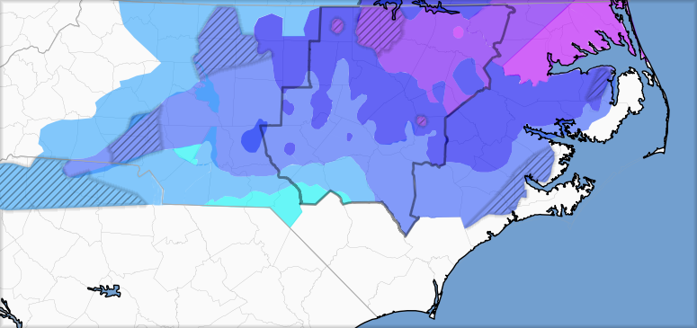

Repository for software and other artifacts for the poster session at the National Weather Association 2020 Annual Meeting.  

Here we analyze a snow event in central North Carolina looking at snowfall forecasts from the National Weather Service along with other 
professional meteorologists.  Combining those varied forecasts into an ensemble produces a forecast which matches the resulting snowfall far better
than any individiual forecast.

